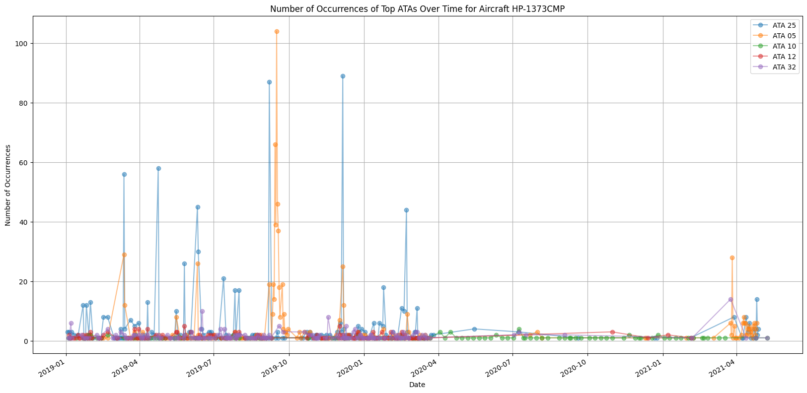
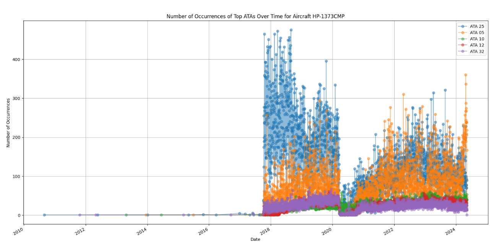
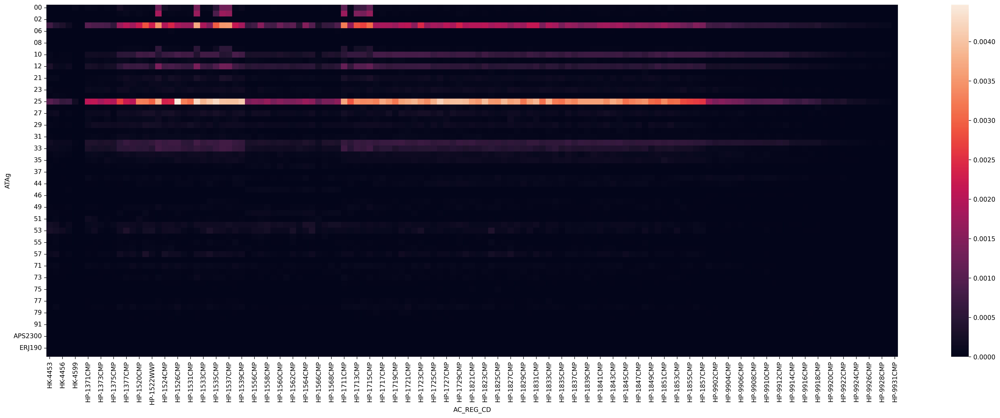
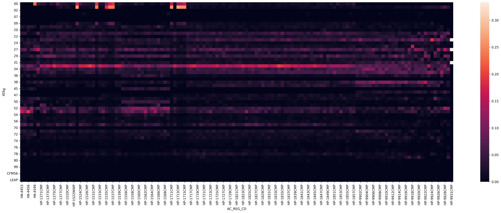

Certainly! Here's an improved version of the report with better structure, more concise explanations, and additional details to enhance clarity and readability:

---

# Analysis of Aircraft Maintenance Data

## Data Trends Post-2019
The following graph illustrates trends in maintenance data after 2019:

**Observations:**
- **Periodic Maintenance Increases:** There is a noticeable increase in maintenance activities, particularly in ATA Chapter 25 (Equipment & Furnishings) and ATA Chapter 05 (Time Limits/Maintenance Checks), approximately every 3-4 months. This periodic surge likely indicates scheduled inspections or recurring maintenance needs.
- **COVID-19 Impact:** A significant drop in maintenance activities during 2020 correlates with the COVID-19 pandemic, reflecting reduced flight operations and aircraft grounding.

## Maintenance Activity Over Time
The graph below provides a comprehensive view of maintenance activity over time:

**Observations:**
- **Pandemic Effect:** The decline in maintenance activities during 2020 is evident and is likely due to the significant reduction in flight operations and subsequent aircraft grounding during the pandemic.

## Aircraft vs. ATA Chapter Heatmap
### Heatmap Overview
The heatmap below visualizes the relationship between different aircraft and ATA Chapters:

#### Heatmap of Aircraft vs. ATA Chapters

**Key Insights:**
- **Dominant ATA Chapters:** ATA Chapter 25 (Equipment & Furnishings) and ATA Chapter 05 (Time Limits/Maintenance Checks) are the most prevalent across the fleet, indicating critical areas for regular maintenance and frequent fault detection.
- **Sparse Data:** Most cells represent low percentages, highlighting specific combinations of `ATAg` and `AC_REG_CD` with minimal occurrences.

#### Heatmap Excluding Top 5 ATA Chapters

**Key Insights:**
- **Detailed Patterns:** By excluding the top 5 ATA Chapters, this heatmap reveals detailed patterns in less frequent maintenance activities. It shows a more comprehensive distribution of other ATA Chapters.
- **Anomalies:** Some aircraft show higher occurrences of ATA 00 and ATA 01 faults, indicating possible anomalies or specific maintenance needs that differ from the general trend.

> ### Note:
> - **Normalization:** The heatmaps are normalized across the Y-axis to minimize the effect of varying entry counts per aircraft, ensuring a fair comparison of maintenance activities.
> - **Rendering Limitations:** Not all aircraft are shown in the heatmap due to rendering limitations, which may affect the visibility of some data points.